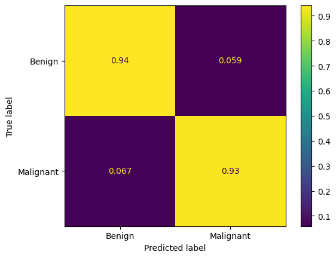
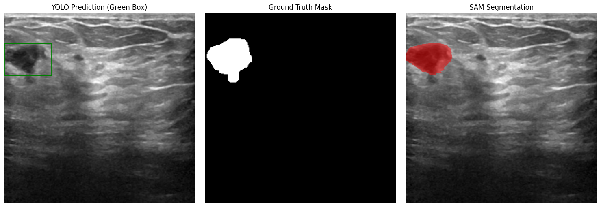
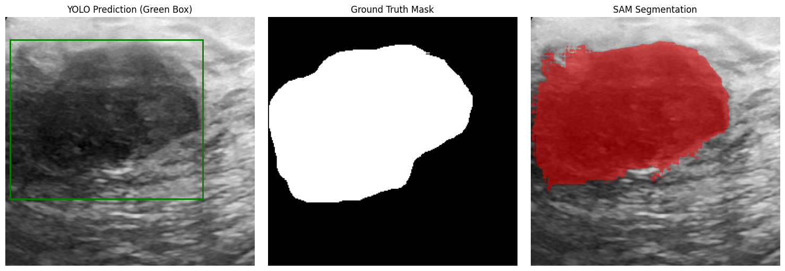
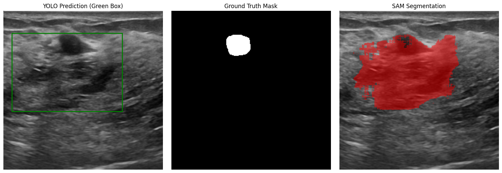
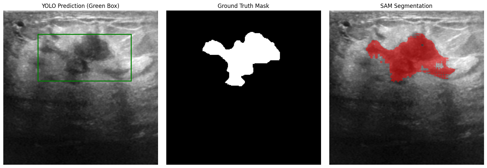

<div align="center">

# 🏥 Breast Cancer Detection & Segmentation Platform

**An end-to-end AI-powered web application for breast ultrasound analysis, combining deep learning detection, segmentation, and classification to support clinical decision-making.**

[](https://www.python.org/)
[](https://www.tensorflow.org/)
[](https://pytorch.org/)
[](https://flask.palletsprojects.com/)
[](https://docs.docker.com/compose/)

</div>

---

## 📌 Overview

This project is a full-stack medical imaging platform designed to assist healthcare professionals in detecting and classifying breast cancer from ultrasound images. It processes standard **DICOM** files through a multi-model AI pipeline that performs:

1. **Tumor Detection** — localizing suspicious regions via bounding boxes  
2. **Tumor Segmentation** — precisely delineating tumor boundaries  
3. **Malignancy Classification** — predicting whether a lesion is benign or malignant  

The system also generates **saliency maps** to provide visual explanations of what the classification model focuses on, promoting transparency and trust in the AI predictions.

> **Note:** This tool is intended to support — not replace — clinical judgment. All data handling complies with GDPR and EU AI Act guidelines.

This project was created in collaboration with [AndreaBaraldi99](https://github.com/AndreaBaraldi99)

---

## 🏗️ Architecture

The application follows a clean **client-server architecture**, fully containerized with Docker Compose.

```
┌─────────────────────────────────────────────────────────────┐
│                        Frontend (Nginx)                     │
│  ┌──────────┐  ┌──────────┐  ┌───────────┐  ┌───────────┐  │
│  │  Login   │  │Dashboard │  │ Patients  │  │ Prediction│  │
│  │  Page    │  │          │  │   List    │  │   Page    │  │
│  └──────────┘  └──────────┘  └───────────┘  └───────────┘  │
└────────────────────────┬────────────────────────────────────┘
                         │ REST API
┌────────────────────────▼────────────────────────────────────┐
│                     Backend (Flask + Gunicorn)               │
│                                                              │
│  ┌─────────┐    ┌─────────────┐    ┌──────────────────────┐ │
│  │  YOLO   │───▶│  SAM 2      │───▶│  VGG / ResNet /      │ │
│  │Detection│    │Segmentation │    │  DenseNet Classifier │ │
│  └─────────┘    └─────────────┘    └──────────────────────┘ │
│                                                              │
│  ┌──────────────────┐    ┌──────────────────┐               │
│  │  SQLite (Users)  │    │ SQLite (Patients) │               │
│  └──────────────────┘    └──────────────────┘               │
└─────────────────────────────────────────────────────────────┘
```

### Tech Stack

| Layer | Technology |
|-------|-----------|
| **Frontend** | HTML5, CSS3, Bootstrap 5, vanilla JavaScript |
| **Backend** | Python 3.10, Flask 3.1, Gunicorn |
| **Detection** | YOLOv8 (Ultralytics), fine-tuned on breast ultrasound data |
| **Segmentation** | SAM 2 (Segment Anything Model 2), fine-tuned on breast ultrasound masks |
| **Classification** | VGG-16, ResNet, DenseNet — all fine-tuned with 5-fold cross-validation |
| **Medical Imaging** | PyDICOM for DICOM file parsing |
| **Explainability** | Gradient-based saliency maps (TensorFlow GradientTape) |
| **Database** | SQLite (users + patient records) |
| **Deployment** | Docker Compose (multi-container) |

---

## 🔬 AI Pipeline

Each uploaded DICOM ultrasound image passes through a three-stage pipeline:

### Stage 1 — Tumor Detection (YOLO)

A YOLOv8 model, fine-tuned on breast ultrasound data, scans the image and predicts bounding boxes around suspicious regions. Non-maximum suppression (NMS) is applied to retain only the most confident detection.

### Stage 2 — Tumor Segmentation (SAM 2)

The detected bounding box is used as a prompt for a fine-tuned **SAM 2 (Segment Anything Model 2)** to produce a pixel-level segmentation mask. This allows precise delineation of the tumor boundary and calculation of the tumor area.

### Stage 3 — Malignancy Classification (CNN)

The preprocessed ultrasound image (resized to 256×256, converted to 3-channel) is classified by one of three selectable deep learning models:

- **VGG-16** — fine-tuned, trained with 5-fold cross-validation  
- **ResNet** — fine-tuned for breast ultrasound classification  
- **DenseNet** — fine-tuned for breast ultrasound classification  

A **saliency map** is generated using gradient-based attribution to highlight the image regions most influential to the model's prediction.

---

## 📊 Results

The pipeline was evaluated on a held-out test set of **32 breast ultrasound images** from the T4R-Biobanks dataset.

### Segmentation Performance

| Metric | Value |
|--------|-------|
| **Mean IoU** | **0.7327** |
| IoU Std Dev | 0.2593 |
| Avg. Inference Time | 0.12 s/image |

### Classification Performance

The confusion matrix below shows the normalized classification results (VGG-16) on the test set:

<div align="center">

</div>

### Segmentation Examples

Each row shows (left to right): **YOLO bounding box detection**, **ground truth mask**, and **SAM 2 predicted segmentation overlay**.

<div align="center">
<table>
<tr>
<td></td>
</tr>
<tr>
<td></td>
</tr>
<tr>
<td></td>
</tr>
<tr>
<td></td>
</tr>
</table>
</div>

---

## 🖥️ Web Application Features

- **Doctor Authentication** — Secure login restricted to verified medical professionals  
- **Patient Dashboard** — Browse and manage patient records stored in the database  
- **Patient Detail View** — View DICOM ultrasound images with adjustable brightness and contrast  
- **Prediction Page** — Upload a DICOM file, select a classification model (VGG / ResNet / DenseNet), and receive:
  - Benign/Malignant classification with confidence score
  - Tumor segmentation overlay with bounding box
  - Estimated tumor area (pixels and percentage)
  - Toggle-able saliency map for model explainability

---

## 🚀 Getting Started

### Prerequisites

- [Docker](https://docs.docker.com/get-docker/) and [Docker Compose](https://docs.docker.com/compose/install/)
- Pre-trained model weights (not included in the repository):
  - `Backend/Models/vgg16_fold5_best.keras`
  - `Backend/Models/resnet_fine_tuned.keras`
  - `Backend/Models/densenet_fine_tuned.keras`
  - `Backend/Models/best_noaug.pt` (YOLO)
  - `Backend/Models/sam2_finetuned_ultrasound_best.pt` (SAM 2)

### Run with Docker Compose

```bash
# Clone the repository
git clone https://github.com/AndreaBaraldi99/Healthcare.git
cd Healthcare

# Place model weights in Backend/Models/

# Build and start the containers
docker-compose up --build
```

The application will be available at:
- **Frontend:** [http://localhost:8080](http://localhost:8080)  
- **Backend API:** [http://localhost:5000](http://localhost:5000)

### Default Credentials

| Email | Password | Role |
|-------|----------|------|
| `admin@admin.it` | `admin` | Doctor |

---

## 📁 Project Structure

```
Healthcare/
├── Backend/
│   ├── app.py                 # Flask API with YOLO + SAM + Classification pipeline
│   ├── models.py              # User and Patient data models (DICOM parsing)
│   ├── dbFunctions.py         # SQLite database operations
│   ├── utility.py             # Image preprocessing, saliency maps, NMS
│   ├── finalPipeline.ipynb    # End-to-end evaluation notebook
│   ├── requirements.txt       # Python dependencies
│   └── Dockerfile
├── Frontend/
│   ├── index.html             # Login page
│   ├── dashboard.html         # Doctor dashboard
│   ├── patients.html          # Patient list with pagination
│   ├── patientDetail.html     # Individual patient view
│   ├── predict.html           # DICOM upload and prediction interface
│   ├── style.css              # Custom styling
│   ├── Resources/             # Static assets
│   └── Dockerfile
├── docker-compose.yml         # Multi-container orchestration
├── docs/images/               # Result images for documentation
└── README.md
```

---

## 🛡️ Compliance & Disclaimer

This application handles sensitive medical data and adheres to the following regulatory frameworks:

- **[GDPR](https://eur-lex.europa.eu/eli/reg/2016/679/oj)** — General Data Protection Regulation for patient data privacy  
- **[EU AI Act](https://artificialintelligenceact.eu/)** — European regulation on high-risk AI systems in healthcare  

> **Disclaimer:** The AI predictions provided by this system are intended as a decision-support tool for qualified medical professionals. They should not be used as a sole basis for clinical diagnosis or treatment decisions.

---

## 📄 License

This project is for educational and research purposes.
